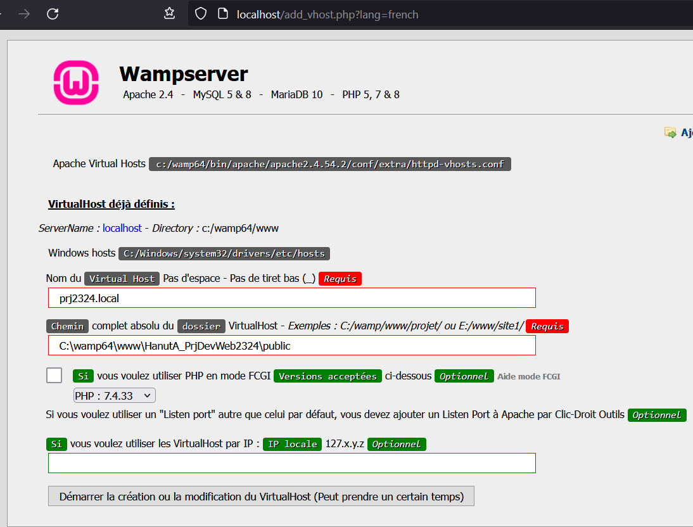
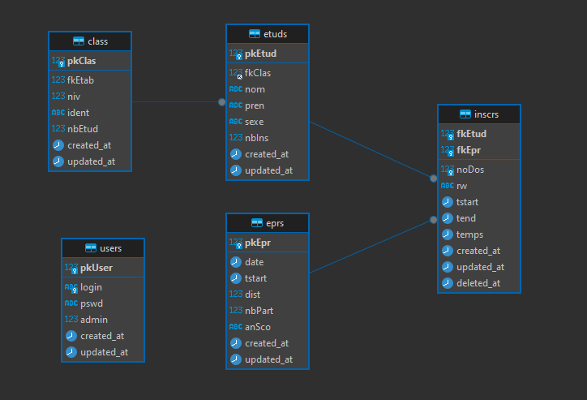

# Projet de développement Web - EAFC 2023/2024 - Hanut Audric

## Déploiement

### Serveur Wamp64

1) Placer le code source du site web dans le dossier suivant :

    ```
    C:\wamp64\www\*NomDuProjet*
    ```
   
2) Création d'un virtual host sur Wamp64

    

3) Création de la Database

## Documentation

### Création de la database

Utilisation de l'outil de migration de Laravel pour la création de la DB.

- Fichiers sources migration
  - *database/migrations/2014_10_12_000000_create_users_table.php*
  - *database/migrations/2014_10_12_000000_create_class_table.php*
  - *database/migrations/2014_10_12_000000_create_etuds_table.php*
  - *database/migrations/2014_10_12_000000_create_eprs_table.php*
  - *database/migrations/2014_10_12_000000_create_inscrs_table.php*
- Configuration de la DB dans le projet
  - *.env*
    - Configuration de l'accès a la DB
  - *app/Providers/AppServiceProvider.php*
    - Définition de la longueur par défaut des chaînes de caractères dans la base de données
  - *config/database.php*
    - Définition de moteur de stockage InnoDB

### Schéma de la database



Tout le code source du projet est documenté. Voici la liste des fichiers créé et modifié lors du développement du site web.

### Création des Models

#### Users

Représentation d'un utilisateur de notre Site Web.

- *app/Models/User.php*

### Création des Controllers

#### AdminController

Ce contrôleur gère la création et le stockage de nouveaux administrateurs.

- *app/Http/Controllers/AdminController.php*

#### SessionController

Ce contrôleur gère les opérations de gestion de session utilisateur, telles que la connexion, la déconnexion, etc.

- *app/Http/Controllers/SessionController.php*

### Création des Requests

#### AdminRequest

Représente une requête pour un administrateur

- *app/Http/Requests/AdminRequest.php*

#### SessionRequest

Cette classe représente une requête de session utilisateur. Elle valide les données entrées par l'utilisateur lors de la connexion

- *app/Http/Requests/SessionRequest.php*

### Création des vues

#### Layouts

Layout de base de ma page HTML 
- *resources/views/Layouts/default.blade.php*

#### Components

Composant utilisé pour afficher un message éphémère à l'utilisateur. Il peut être utilisé pour afficher des messages d'alerte, de succès, etc.
- *resources/views/components/flash-message.blade.php*
- *app/View/Components/FlashMessage.php*

Composant utilisé pour afficher une barre de navigation en utilisant des éléments de navigation spécifiés.
- *resources/views/components/breadcrumb.blade.php*
- *app/View/Components/Breadcrumb.php*

### Création des middlewares

#### FirstTimeSetup

Ce middleware vérifie si c'est la première fois que le setup est effectué dans l'application. S'il n'y a aucun utilisateur enregistré dans la base de données, il redirige l'utilisateur vers la page d'inscription de l'administrateur.

- *app/Http/Middleware/FirstTimeSetup.php*
- *app/Http/Kernel.php*

#### AdminCreated

Ce middleware vérifie si un administrateur a déjà été créé dans l'application. Si un utilisateur est enregistré dans la base de données, il redirige l'utilisateur vers la page d'accueil.

- *app/Http/Middleware/AdminCreated.php*
- *app/Http/Kernel.php*


