# Projet de développement Web - EAFC 2023/2024 - Hanut Audric


* [Projet de développement Web - EAFC 2023/2024 - Hanut Audric](#projet-de-développement-web---eafc-20232024---hanut-audric)
  * [1) Déploiement](#1-déploiement)
    * [1.1) Serveur Wamp64](#11-serveur-wamp64)
  * [2) Documentation](#2-documentation)
    * [2.1) Création de la database](#21-création-de-la-database)
      * [2.1.1) Schéma de la database](#211-schéma-de-la-database)
    * [2.2) Utilisation du pattern de conception MVC](#22-utilisation-du-pattern-de-conception-mvc)
      * [2.2.1) M - Création des Models](#221-m---création-des-models)
      * [2.2.2)  V - Création des vues](#222-v---création-des-vues)
        * [Layouts](#layouts)
        * [Vues](#vues)
        * [Components](#components)
      * [2.2.3) C - Création des Controllers](#223-c---création-des-controllers)
    * [2.3) Autres outils Laravel utilisés](#23-autres-outils-laravel-utilisés)
      * [2.3.1) Création des Requests](#231-création-des-requests)
      * [2.3.2) Création des middlewares](#232-création-des-middlewares)
      * [2.3.3) Création des Policy](#233-création-des-policy)
  * [3) Mode d’emploi utilisateur sommaire](#3-mode-demploi-utilisateur-sommaire)
    * [3.1) Première utilisation](#31-première-utilisation)
    * [3.2) Utilisation](#32-utilisation)
<!-- TOC -->


## 1) Déploiement

### 1.1) Serveur Wamp64

1.1.1) Placer le code source du site web dans le dossier suivant :

    ```
    C:\wamp64\www\*NomDuProjet*
    ```

1.1.2) Création d'un virtual host sur Wamp64

   

## 2) Documentation

### 2.1) Création de la database

Utilisation de l'outil de migration de Laravel pour la création de la DB.

- Fichiers sources migration

| Table | Fichier source                                                  |
|:------|:----------------------------------------------------------------|
| Users | *database/migrations/2014_10_12_000000_create_users_table.php*  |
| Class | *database/migrations/2014_10_12_000000_create_class_table.php*  |
| Class | *database/migrations/2014_10_12_000000_create_etuds_table.php*  |
| Class | *database/migrations/2014_10_12_000000_create_eprs_table.php*   |
| Class | *database/migrations/2014_10_12_000000_create_inscrs_table.php* |

- Configuration de la DB dans le projet
    - *.env*
        - Configuration de l'accès a la DB
    - *app/Providers/AppServiceProvider.php*
        - Définition de la longueur par défaut des chaînes de caractères dans la base de données
    - *config/database.php*
        - Définition de moteur de stockage InnoDB

#### 2.1.1) Schéma de la database


- Par rapport à l'ébauche de schéma relationnel de la DB de départ, quelque modifications ont été apportées :
    - Ajout des colonnes created_at et updated_at ; attributs généré par défaut par laravel que j'ai choisi de laisser,
      si jamais nous décidions des triers des informations sur leur date de création et/ou de mise à jour
    - Suppresion de la clé primaire PkInscr de la table Inscrs : J'ai choisi d'utilisé une clé primaire composite
      de [fkEtud;fkEpr] afin de mieux controler la duplication de données dans cette table

### 2.2) Utilisation du pattern de conception MVC

Une documentation plus complète des Classes, attributs et méthodes est implémentée dans le code source.
Voici cependant une documentation minimale expliquant le projet

#### 2.2.1) M - Création des Models

| Model | Description                                                            | Fichier source         |
|:------|:-----------------------------------------------------------------------|:-----------------------|
| Users | Représentation d'un utilisateur de notre Site Web.                     | *app/Models/User.php*  |
| Clas  | Ce modèle représente une classe dans l'application.                    | *app/Models/Clas.php*  |
| Etud  | Ce modèle représente un étudiant dans l'application.                   | *app/Models/Etud.php*  |
| Epr   | Représente une épreuve.                                                | *app/Models/Epr.php*   |
| Inscr | Représente le modèle d'une inscription à une épreuve pour un étudiant. | *app/Models/Inscr.php* |

#### 2.2.2)  V - Création des vues

##### Layouts

Layout de base de ma page HTML

- *resources/views/Layouts/default.blade.php*

Un autre layout qui implémente le default est utilisé, celui-ci inclus la navbar et sera donc utilisé sur les pages ou
l'utilisateur est authentifié.

- *resources/views/Layouts/default_with_navbar.blade.php*

##### Vues

| Vue            | Description                                                                        | Fichier source                             |
|:---------------|:-----------------------------------------------------------------------------------|:-------------------------------------------|
| Admin.create   | Vue du formulaire de création de l'administrateur                                  | *resources/views/Admin/create.blade.php*   |
| Session.create | Vue du formulaire de connexion                                                     | *resources/views/Session/create.blade.php* |
| Session.delete | Vue de confirmation de déconnexion                                                 | *resources/views/Session/delete.blade.php* |
| Welcome        | Vue de la page d'accueil, affichant les statistiques                               | *resources/views/welcome.blade.php*        |
| Clas.create    | Vue du formulaire de création d'une classe                                         | *resources/views/Clas/create.blade.php*    |
| Clas.delete    | Vue du formulaire de suppression d'une classe                                      | *resources/views/Clas/delete.blade.php*    |
| Clas.edit      | Vue du formulaire d'édition d'une classe                                           | *resources/views/Clas/edit.blade.php*      |
| Clas.index     | Vue de l'index reprenants les infos de toutes les classes encodées                 | *resources/views/Clas/index.blade.php*     |
| Etud.create    | Vue du formulaire de création d'un étudiant                                        | *resources/views/Etud/create.blade.php*    |
| Etud.delete    | Vue du formulaire de suppression d'un étudiant                                     | *resources/views/Etud/delete.blade.php*    |
| Etud.edit      | Vue du formulaire d'édition d'un étudiant                                          | *resources/views/Etud/edit.blade.php*      |
| Etud.index     | Vue de l'index reprenants les infos de toutes les étudiants encodées               | *resources/views/Etud/index.blade.php*     |
| Epr.create     | Vue du formulaire de création d'une épreuveEpr                                     | *resources/views/Epr/create.blade.php*     |
| Epr.delete     | Vue du formulaire de suppression d'une épreuve                                     | *resources/views/Epr/delete.blade.php*     |
| Epr.edit       | Vue du formulaire d'édition d'une épreuve                                          | *resources/views/Epr/edit.blade.php*       |
| Epr.index      | Vue de l'index reprenants les infos de toutes les épreuves encodées                | *resources/views/Epr/index.blade.php*      |
| Inscr.show     | Vue des détails d'une inscription à une épreuve.                                   | *resources/views/Inscr/show.blade.php*     |
| Inscr.edit     | Vue du formulaire pour l'inscription à une épreuve spécifique.                     | *resources/views/Inscr/edit.blade.php*     |
| Inscr.index    | Vue de l'index permettant de choisir l'épreuve des inscriptions a afficher         | *resources/views/Inscr/index.blade.php*    |
| Arriv.edit     | Vue du formulaire permettant d'encodée les arrivées                                | *resources/views/Arriv/edit.blade.php*     |
| Arriv.index    | Vue de l'index permettant de choisir l'épreuve pour laquelle encodées les arrivées | *resources/views/Arriv/index.blade.php*    |

##### Components

Utilisation de components blade afin d'utiliser la réutilisabilité de ceux-ci dans plusieurs vues

| Component     | Description                                                                                                                                    | Fichier source                                                                                        |
|:--------------|:-----------------------------------------------------------------------------------------------------------------------------------------------|:------------------------------------------------------------------------------------------------------|
| FlashMessage  | Composant utilisé pour afficher un message éphémère à l'utilisateur. Il peut être utilisé pour afficher des messages d'alerte, de succès, etc. | - *resources/views/components/flash-message.blade.php*<br>- *app/View/Components/FlashMessage.php*    |
| Breadcrumb    | Composant utilisé pour afficher une barre de navigation en utilisant des éléments de navigation spécifiés.                                     | - *resources/views/components/breadcrumb.blade.php*<br>- *app/View/Components/Breadcrumb.php*         |
| ClasTable     | Composant Blade pour afficher une table de classes.                                                                                            | - *resources/views/components/clas-table.blade.php*<br>- *app/View/Components/ClasTable.php*          |
| Search        | Composant Blade pour une barre de recherche.                                                                                                   | - *resources/views/components/search.blade.php*<br>- *app/View/Components/Search.php*                 |
| ClasForm      | Composant Blade pour afficher un formulaire de classe.                                                                                         | - *resources/views/components/clas-form.blade.php*<br>- *app/View/Components/ClasForm.php*            |
| DeleteForm    | Composant Blade pour afficher un formulaire de suppression.                                                                                    | - *resources/views/components/delete-form.blade.php*<br>- *app/View/Components/DeleteForm.php*        |
| EtudTable     | Composant Blade pour afficher un tableau d'étudiants.                                                                                          | - *resources/views/components/etud-table.blade.php*<br>- *app/View/Components/EtudTable.php*          |
| EtudForm      | Composant Blade qui représente un formulaire pour la création ou la modification d'un étudiant.                                                | - *resources/views/components/etud-form.blade.php*<br>- *app/View/Components/EtudForm.php*            |
| EprTable      | Composant Blade pour représenter un tableau d'affichage des épreuves.                                                                          | - *resources/views/components/epr-table.blade.php*<br>- *app/View/Components/EprTable.php*            |
| EprForm       | Composant Blade pour représenter un formulaire pour les épreuves.                                                                              | - *resources/views/components/epr-form.blade.php*<br>- *app/View/Components/EprForm.php*              |
| ArrivForm     | Composant Blade pour afficher le formulaire d'arrivée des étudiants à une épreuve.                                                             | - *resources/views/components/arriv-form.blade.php*<br>- *app/View/Components/ArrivForm.php*          |
| EditInscrForm | Composant Blade pour afficher le formulaire de modification des inscriptions à une épreuve.                                                    | - *resources/views/components/edit-inscr-form.blade.php*<br>- *app/View/Components/EditInscrForm.php* |
| ShowInscrForm | Composant pour afficher le formulaire de détails d'une inscription à une épreuve.                                                              | - *resources/views/components/show-inscr-form.blade.php*<br>- *app/View/Components/ShowInscrForm.php* |
| ArrivTable    | Composant Blade pour afficher le tableau de détails d'arrivée des étudiants à une course.                                                      |                                                                                                       |

#### 2.2.3) C - Création des Controllers

| Controller        | Description                                                                                                        | Fichier source                               |
|:------------------|:-------------------------------------------------------------------------------------------------------------------|:---------------------------------------------|
| AdminController   | Ce contrôleur gère la création et le stockage de nouveaux administrateurs.                                         | *app/Http/Controllers/AdminController.php*   |
| SessionController | Ce contrôleur gère les opérations de gestion de session utilisateur, telles que la connexion, la déconnexion, etc. | *app/Http/Controllers/SessionController.php* |
| ClasController    | Ce contrôleur gère les opérations liées aux classes dans l'application.                                            | *app/Http/Controllers/ClasController.php*    |
| EtudController    | Contrôleur pour la gestion des étudiants.                                                                          | *app/Http/Controllers/EtudController.php*    |
| EprController     | Gère les opérations liées aux épreuves.                                                                            | *app/Http/Controllers/EprController.php*     |
| InscrController   | Contrôleur pour la gestion des inscriptions aux épreuves.                                                          | *app/Http/Controllers/InscrController.php*   |
| ArrivController   | Contrôleur gérant les arrivées des étudiants aux épreuves.                                                         | *app/Http/Controllers/ArrivController.php*   |
| StatsController   | Contrôleur générant les statistiques.                                                                              | *app/Http/Controllers/StatsController.php*   |

### 2.3) Autres outils Laravel utilisés

#### 2.3.1) Création des Requests

Les requests dans Laravel servent à valider et à traiter les données provenant des requêtes HTTP entrantes. Ils
permettent de valider les données en fonction de règles définies, de simplifier le processus de récupération des données
et de centraliser la logique de traitement des données dans des classes dédiées

| Politique   | Description                              | Fichier                          |
|:------------|:-----------------------------------------|:---------------------------------|
| ClasPolicy  | Politique d'accès pour les classes.      | - *app/Policies/ClasPolicy.php*  |
| EtudPolicy  | Politique d'accès pour les étudiants.    | - *app/Policies/EtudPolicy.php*  |
| EprPolicy   | Politique d'accès pour les épreuves.     | - *app/Policies/EprPolicy.php*   |
| InscrPolicy | Politique d'accès pour les inscriptions. | - *app/Policies/InscrPolicy.php* |

#### 2.3.2) Création des middlewares

Les middlewares dans Laravel servent à filtrer les requêtes HTTP entrantes de l'application avant qu'elles n'atteignent
les routes ou les contrôleurs. Ils permettent d'ajouter des couches de logique intermédiaire pour effectuer des tâches
telles que l'authentification, l'autorisation, la manipulation des données de requête, la gestion des sessions,...

| Middleware     | Description                                                                                                                                                                                                                              | Fichiers                                                              |
|:---------------|:-----------------------------------------------------------------------------------------------------------------------------------------------------------------------------------------------------------------------------------------|:----------------------------------------------------------------------|
| FirstTimeSetup | Ce middleware vérifie si c'est la première fois que le setup est effectué dans l'application. S'il n'y a aucun utilisateur enregistré dans la base de données, il redirige l'utilisateur vers la page d'inscription de l'administrateur. | - *app/Http/Middleware/FirstTimeSetup.php*<br>- *app/Http/Kernel.php* |
| AdminCreated   | Ce middleware vérifie si un administrateur a déjà été créé dans l'application. Si un utilisateur est enregistré dans la base de données, il redirige l'utilisateur vers la page d'accueil.                                               | - *app/Http/Middleware/AdminCreated.php*<br>- *app/Http/Kernel.php*   |

#### 2.3.3) Création des Policy

Les politiques (policies) dans Laravel servent à définir des règles d'autorisation pour les différentes actions sur des
modèles de données. Elles permettent de centraliser la logique d'autorisation dans des classes dédiées, en spécifiant
quelles actions un utilisateur peut effectuer sur un modèle donné. Les politiques sont souvent utilisées pour déterminer
si un utilisateur peut créer, afficher, mettre à jour ou supprimer une instance particulière d'un modèle.

| Politique   | Description                              | Fichier                          |
|:------------|:-----------------------------------------|:---------------------------------|
| ClasPolicy  | Politique d'accès pour les classes.      | - *app/Policies/ClasPolicy.php*  |
| EtudPolicy  | Politique d'accès pour les étudiants.    | - *app/Policies/EtudPolicy.php*  |
| EprPolicy   | Politique d'accès pour les épreuves.     | - *app/Policies/EprPolicy.php*   |
| InscrPolicy | Politique d'accès pour les inscriptions. | - *app/Policies/InscrPolicy.php* |

## 3) Mode d’emploi utilisateur sommaire

### 3.1) Première utilisation

Lors de la première utilisation, il est impossible d'accéder au site web sans enregistrer un administrateur :

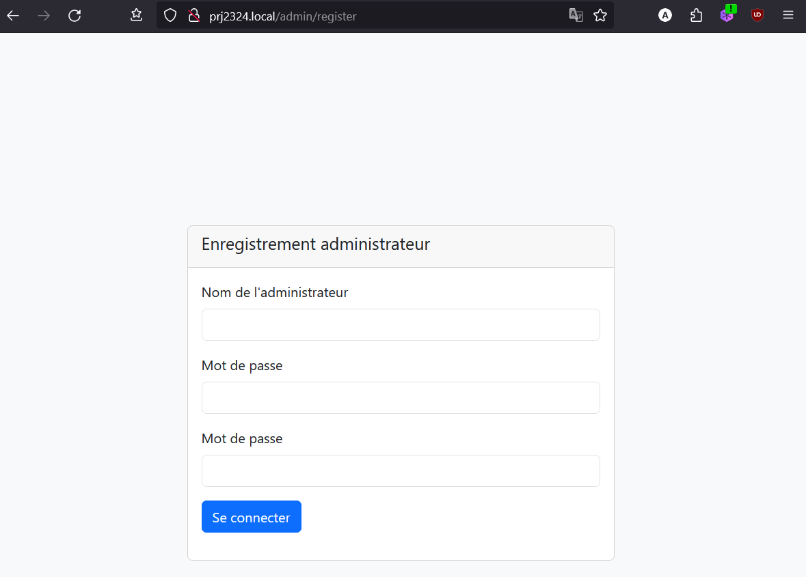

Une fois l'administrateur créé, celui-ci est automatiquement connecté et arrive sur la page d'accueil, reprenant les
différentes statistiques.

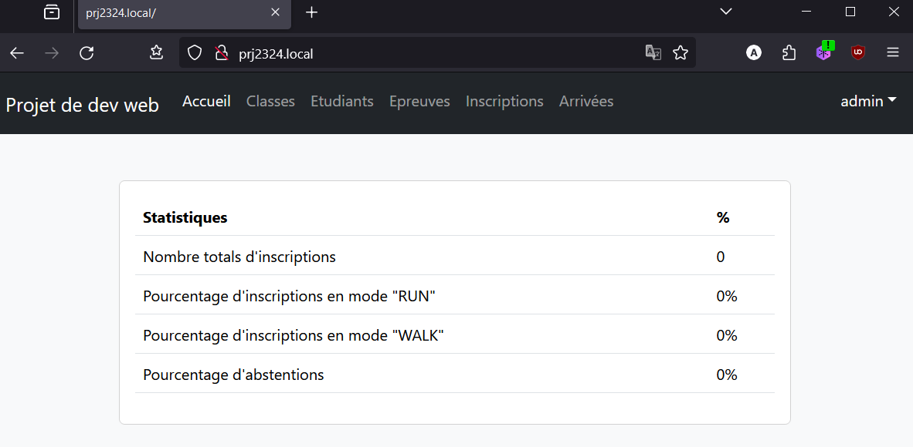

### 3.2) Utilisation

Le menu permet d'accéder aux différentes possibilitées du site web.

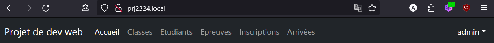

La structure pour les Classes, les Etudiants et les Epreuves est identiques :

- La page principal permet de visualiser la liste des éléments, de faire une recherche sur ceux-ci, d'accéder aux
  formulaire de création de l'élément et d'afficher les détails de ceux-ci :

1. Permet d'effectuer une recherche d'un élément
2. Permet d'accéder au formulaire de création de l'élement
3. Permet d'afficher un élément, ce qui permet de voir / éditer / supprimer celui-ci
4. Permet de naviguer parmit les éléments quand ceux-ci sont supérieur à 10.

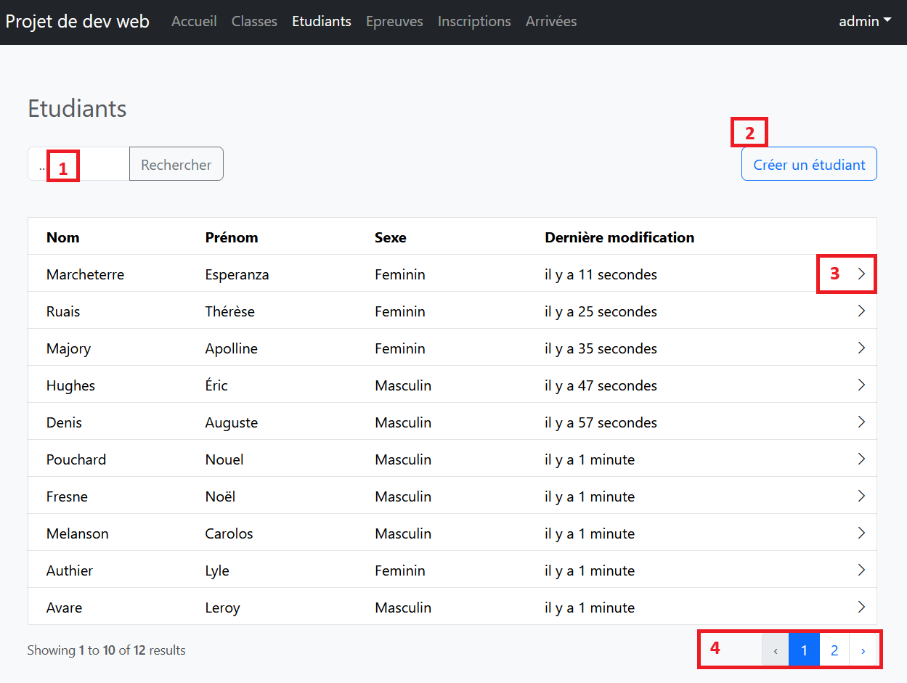

- Affichage de l'élément

1. Zone d'affichage / d'édition de l'élément
2. Accèder a la suppression de l'élément ( avec confirmation )
3. Enregistre les modifications effectuée dans la zone d'édition

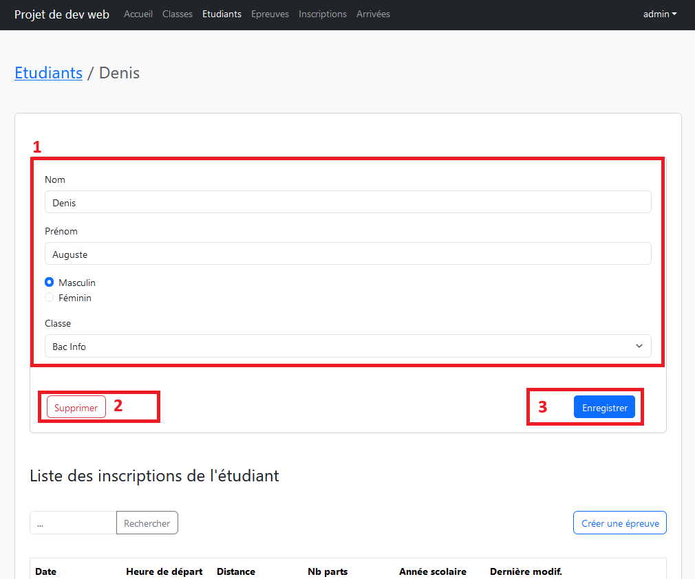

Pour les inscriptions, il nous faut selectionner l'épreuve qui nous interesse

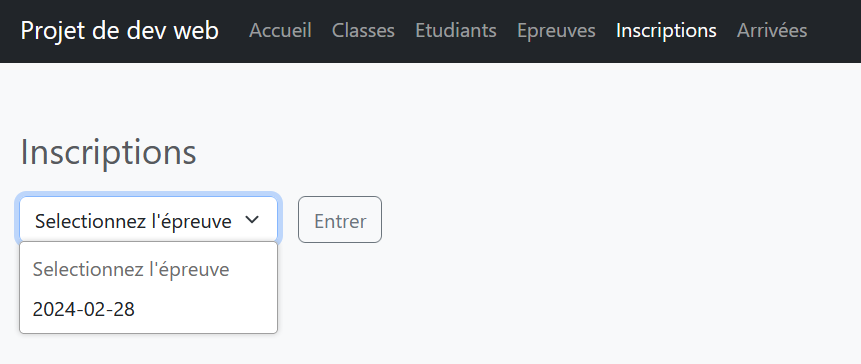

Nous sommes alors rediriger vers la page d'inscription, pour l'inscription il faut une heure (si pas encodé dans
l'épreuve) et un type de coureur (run/walk) :
Ensuite appuyé sur le + Vert afin de valider l'inscription.
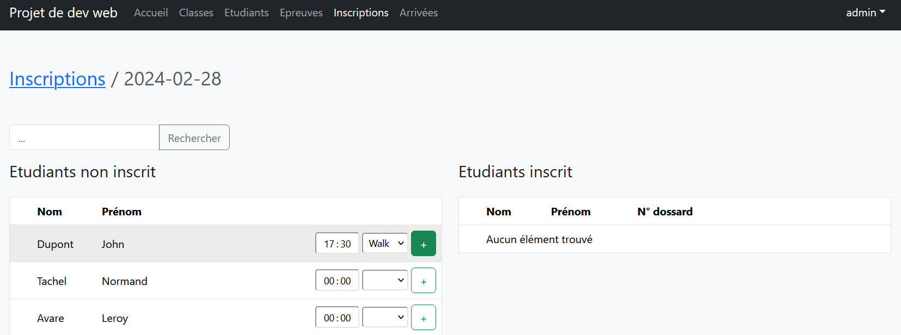

L'étudiant devrait alors apparaitre dans la liste des étudiants inscrits

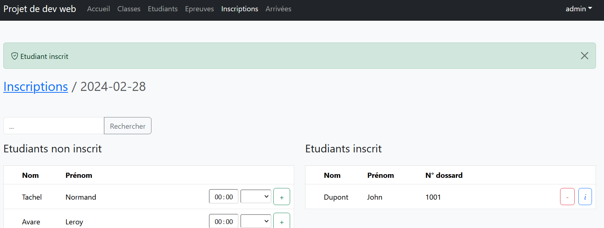

- Le '- Rouge' permet alors de désinscrire l'étudiant (uniquement si il n'a pas fini l'épreuve).
- Le 'i bleu' permet d'afficher et d'éditer (si l'épreuve n'est pas terminé) l'inscription.

Pour les arrivées, il nous faut selectionner l'épreuve qui nous interesse

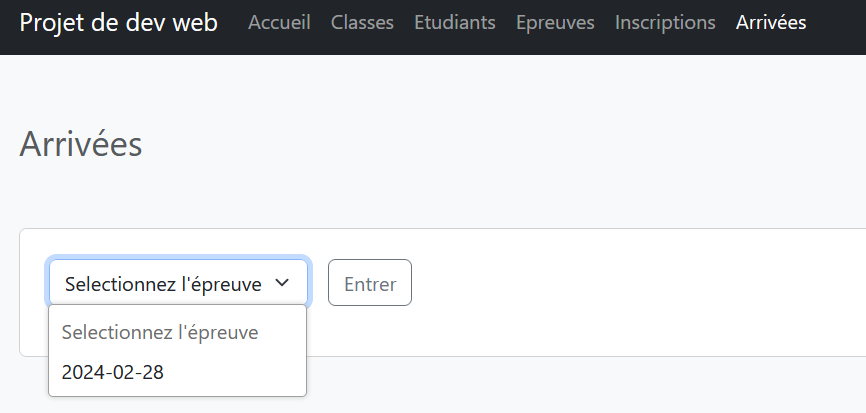

Il faut encodé le n° de dossard (trouvable dans les tableaux d'inscriptions aux épreuves) et enregistré : 

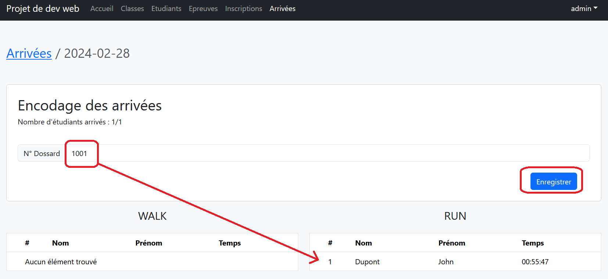

### 3.3) Deconnexion 

Pour se déconnecter, il suffit de cliquer en haut à droite de l'application, sur son nom d'utilisateur et de selectionner "Se déconnecter"

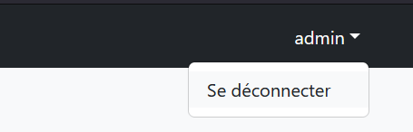
